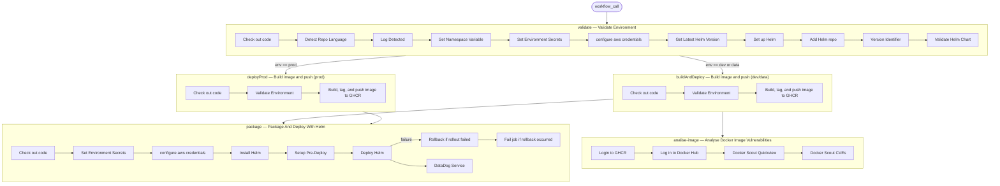

# Build and Deploy

This reusable workflow builds a Docker image, pushes it to the GitHub Container Registry, and deploys it to an Amazon EKS cluster using Helm. It also validates the Helm chart and scans the resulting image for vulnerabilities.

## Triggers

This workflow is triggered via `workflow_call`, meaning it must be called by another workflow. It accepts two inputs:

| Input | Required | Type | Description |
|---|---|---|---|
| `environment` | Yes | string | Target deployment environment (`dev`, `data`, or `prod`) |
| `data-env` | No | string | Optional override for the Kubernetes namespace when deploying to the `data` environment |

## Permissions

| Permission | Level | Purpose |
|---|---|---|
| `id-token` | `write` | Allows the workflow to request an OIDC token, enabling keyless authentication with AWS via `aws-actions/configure-aws-credentials` |
| `contents` | `read` | Allows the workflow to read repository contents (e.g., `actions/checkout`) |

## Flow

## Jobs

### Job: `validate` — Validate Environment

Checks out the repository, detects the primary programming language, determines the Kubernetes namespace, configures AWS credentials, fetches and installs Helm, adds the private Helm chart repository, and validates that the target Helm chart renders correctly for the given environment.

- **Runs on**: `vitat-${{ inputs.environment }}`

#### Steps

1. **Check out code**
   - **Action / Command**: `actions/checkout@v3`
   - **Purpose**: Checks out the repository so subsequent steps can access source files and Helm configuration.

2. **Detect Repo Language**
   - **Action / Command**: `sejavitat/shared-workflows/.github/actions/detect-language@datadog-envs`
   - **Purpose**: Determines the repository's primary programming language and type (`typeRepo`). The detected language is later used to set the correct Datadog library version in the Helm values.
   - **Key inputs / parameters**: `app_name` (repository name), `github_token`

3. **Log Detected**
   - **Action / Command**: Runs shell command
   - **Purpose**: Prints the detected language and repository type for debugging purposes.

4. **Set Namespace Variable**
   - **Action / Command**: Runs shell command
   - **Purpose**: Determines the Kubernetes namespace based on the application name and environment. Sets output `namespace` and environment variable `NAME_SPACE`.
     - Apps not prefixed with `ai-` and not named `event-data-api` → `vitat-apps`
     - `ai-*` apps in `prod` → `vitat-ai`
     - If `data-env` input is provided → uses that value
     - Fallback → `dev`

5. **Set Environment Secrets**
   - **Action / Command**: Runs shell command
   - **Purpose**: Populates `AWS_REGION`, `AWS_CLUSTER_ROLE_ARN`, and `AWS_CLUSTER_ROLE_SESSION_NAME` environment variables from the appropriate secrets for the selected environment (`dev`, `prod`, or `data`).

6. **configure aws credentials**
   - **Action / Command**: `aws-actions/configure-aws-credentials@v4.1.0`
   - **Purpose**: Authenticates with AWS using OIDC (no static credentials), assuming the role specified by `AWS_CLUSTER_ROLE_ARN`.
   - **Key inputs / parameters**: `role-to-assume`, `role-session-name`, `aws-region`

7. **Get Latest Helm Version**
   - **Action / Command**: Runs shell command
   - **Purpose**: Fetches the latest stable Helm version string from `https://get.helm.sh/helm-latest-version` and stores it in `HELM_VERSION`.

8. **Set up Helm**
   - **Action / Command**: `azure/setup-helm@v3`
   - **Purpose**: Installs the specified Helm version on the runner.
   - **Key inputs / parameters**: `version: ${{ env.HELM_VERSION }}`

9. **Add Helm repo**
   - **Action / Command**: Runs shell command
   - **Purpose**: Registers the private `vitat-chart` Helm repository hosted at `http://chartmuseum-private:8080` and refreshes the local cache.
   - **Key inputs / parameters**: `--username vitat-admin`, `--password ${{ secrets.HELM_REPO_PASSWORD }}`

10. **Version Identifier**
    - **Action / Command**: Runs shell command
    - **Purpose**: Sets `RUN_IDENTIFIER` — uses `github.run_number` for `dev`/`data` and `github.ref_name` (tag/branch) for `prod`.

11. **Validate Helm Chart**
    - **Action / Command**: Runs shell command
    - **Purpose**: Runs `helm template` against `vitat-chart/vitat-chart` version `1.0.97` to confirm the chart renders without errors before any image is built or deployed. Uses `data-env` override config file when provided, otherwise uses the environment config file.
    - **Key inputs / parameters**: `-f ./k8s/<env>.yaml`, `--namespace`, Datadog library version flags

---

### Job: `buildAndDeploy` — Build image and push to registry (dev/data)

Builds the Docker image and pushes it to the GitHub Container Registry for `dev` and `data` environments.

- **Runs on**: `vitat-data` (if `data`), otherwise `ubuntu-latest`
- **Needs**: `validate`
- **Condition**: Only runs when `inputs.environment == 'dev'` or `inputs.environment == 'data'`

#### Steps

1. **Check out code**
   - **Action / Command**: `actions/checkout@v3`
   - **Purpose**: Checks out the repository so the Dockerfile and application source are available.

2. **Validate Environment**
   - **Action / Command**: Runs shell command
   - **Purpose**: Guards against unsupported environment values; exits with code `1` if the input is not `dev`, `prod`, or `data`.

3. **Build, tag, and push image to Github Container Registry**
   - **Action / Command**: Runs shell command
   - **Purpose**: Logs in to `ghcr.io`, builds the Docker image, tags it as `ghcr.io/sejavitat/<APP_NAME>:<SHA>`, and pushes it.
   - **Key inputs / parameters**: `secrets.REGISTRY_TOKEN`, image tag `${{ env.RELEASE_LABEL }}` (git SHA)

---

### Job: `deployProd` — Build image and push to registry (prod)

Builds and pushes the Docker image for the `prod` environment.

- **Runs on**: `ubuntu-latest`
- **Needs**: `validate`
- **Condition**: Only runs when `inputs.environment == 'prod'`

#### Steps

1. **Check out code**
   - **Action / Command**: `actions/checkout@v3`
   - **Purpose**: Checks out the repository so the Dockerfile is available.

2. **Validate Environment**
   - **Action / Command**: Runs shell command
   - **Purpose**: Guards against unsupported environment values; exits with code `1` if the input is invalid.

3. **Build, tag, and push image to Github Container Registry**
   - **Action / Command**: Runs shell command
   - **Purpose**: Logs in to `ghcr.io` and builds/pushes the Docker image for production.
   - **Key inputs / parameters**: `secrets.REGISTRY_TOKEN`

---

### Job: `package` — Package And Deploy With Helm

Packages the application using Helm and deploys it to the EKS cluster. Performs automatic rollback if the Helm deployment fails, and posts a Datadog APM link to the job summary.

- **Runs on**: `vitat-${{ inputs.environment }}`
- **Needs**: `validate`, `buildAndDeploy`, `deployProd`
- **Condition**: Runs if `validate` succeeded and either `buildAndDeploy` or `deployProd` succeeded.

#### Steps

1. **Check out code**
   - **Action / Command**: `actions/checkout@v3`
   - **Purpose**: Checks out the repository to access Helm values files under `./k8s/`.

2. **Set Environment Secrets**
   - **Action / Command**: Runs shell command
   - **Purpose**: Populates AWS credentials environment variables from secrets based on the selected environment (same logic as in `validate`).

3. **configure aws credentials**
   - **Action / Command**: `aws-actions/configure-aws-credentials@v4.1.0`
   - **Purpose**: Authenticates with AWS via OIDC to allow `kubectl`/`helm` commands against EKS.
   - **Key inputs / parameters**: `role-to-assume`, `role-session-name`, `aws-region`

4. **Install Helm**
   - **Action / Command**: Runs shell command
   - **Purpose**: Installs AWS CLI v2 and Helm 3 on the runner, then configures `kubectl` to target the correct EKS cluster via `aws eks update-kubeconfig`.
   - **Key inputs / parameters**: EKS cluster name `${{ inputs.ENVIRONMENT }}-eks`

5. **Setup Pre-Deploy**
   - **Action / Command**: Runs shell command
   - **Purpose**: Prepares deployment variables: sets `RUN_IDENTIFIER`, determines the Helm values file path (`CONFIG_FILES`), sets `HELM_VERSION` to `1.0.97`, and assembles the full `VALUES` string with image repository, tag, language versions, and run identifier.

6. **Deploy Helm**
   - **Action / Command**: `sejavitat/github-actions-deploy-eks-helm@v1`
   - **Purpose**: Performs the Helm upgrade/install of `vitat-chart/vitat-chart` to the EKS cluster with a 900-second timeout and `--wait` flag. `continue-on-error: true` allows the rollback step to execute on failure.
   - **Key inputs / parameters**: `cluster-name`, `config-files`, `namespace`, `chart-repository`, `values`, `timeout: 900s`, `helm-wait: true`, `version: 1.0.97`

7. **Rollback if rollout failed**
   - **Action / Command**: Runs shell command
   - **Purpose**: If the Deploy Helm step failed, identifies the last successfully deployed Helm revision and rolls back to it. Sets `ROLLBACK_OCCURRED=true` and exits with code `1`.

8. **Fail job if rollback occurred**
   - **Action / Command**: Runs shell command
   - **Purpose**: Ensures the job is marked as failed after a rollback, so callers and status checks are aware of the deployment failure.

9. **DataDog Service**
   - **Action / Command**: Runs shell command
   - **Purpose**: Always runs (even on failure) to add a Datadog APM service link to the GitHub Actions job summary for quick access to observability data.

---

### Job: `analise-image` — Analise Docker Image Vulnerabilities

Scans the newly pushed Docker image for critical and high-severity CVEs using Docker Scout.

- **Runs on**: `vitat-${{ inputs.environment }}`
- **Needs**: `buildAndDeploy`

#### Steps

1. **Login to GHCR**
   - **Action / Command**: Runs shell command
   - **Purpose**: Authenticates with `ghcr.io` so the built image can be pulled for scanning.
   - **Key inputs / parameters**: `secrets.REGISTRY_TOKEN`

2. **Log in to Docker Hub**
   - **Action / Command**: `docker/login-action@v3`
   - **Purpose**: Authenticates with Docker Hub, which is required by Docker Scout to access vulnerability databases.
   - **Key inputs / parameters**: `username: ${{ secrets.DOCKERHUB_USERNAME }}`, `password: ${{ secrets.DOCKERHUB_TOKEN }}`

3. **Docker Scout Quickview**
   - **Action / Command**: `docker/scout-action@v1`
   - **Purpose**: Produces a high-level vulnerability summary for the image, filtered to `critical` and `high` severities only.
   - **Key inputs / parameters**: `command: quickview`, `image: ghcr.io/sejavitat/<APP_NAME>:<SHA>`, `only-severities: critical,high`

4. **Docker Scout CVEs**
   - **Action / Command**: `docker/scout-action@v1`
   - **Purpose**: Lists all individual CVEs found in the image at `critical` and `high` severity levels.
   - **Key inputs / parameters**: `command: cves`, `image: ghcr.io/sejavitat/<APP_NAME>:<SHA>`, `only-severities: critical,high`

## Required Secrets and Variables

| Secret / Variable | Description |
|---|---|
| `secrets.GITHUB_TOKEN` | Built-in GitHub token used by the `detect-language` action and Docker Scout to interact with the GitHub API |
| `secrets.DEV_AWS_REGION` | AWS region for the `dev` environment |
| `secrets.DEV_AWS_CLUSTER_ROLE_ARN` | IAM role ARN to assume for accessing the `dev` EKS cluster |
| `secrets.DEV_AWS_CLUSTER_ROLE_SESSION_NAME` | Session name for the `dev` AWS role assumption |
| `secrets.PROD_AWS_REGION` | AWS region for the `prod` environment |
| `secrets.PROD_AWS_CLUSTER_ROLE_ARN` | IAM role ARN to assume for accessing the `prod` EKS cluster |
| `secrets.PROD_AWS_CLUSTER_ROLE_SESSION_NAME` | Session name for the `prod` AWS role assumption |
| `secrets.DATA_AWS_REGION` | AWS region for the `data` environment |
| `secrets.DATA_AWS_CLUSTER_ROLE_ARN` | IAM role ARN to assume for accessing the `data` EKS cluster |
| `secrets.DATA_AWS_CLUSTER_ROLE_SESSION_NAME` | Session name for the `data` AWS role assumption |
| `secrets.HELM_REPO_PASSWORD` | Password for authenticating with the private ChartMuseum Helm repository |
| `secrets.REGISTRY_TOKEN` | Personal access token (or PAT) used to authenticate with `ghcr.io` for pushing and pulling Docker images |
| `secrets.DOCKERHUB_USERNAME` | Docker Hub username for Docker Scout authentication |
| `secrets.DOCKERHUB_TOKEN` | Docker Hub access token for Docker Scout authentication |
