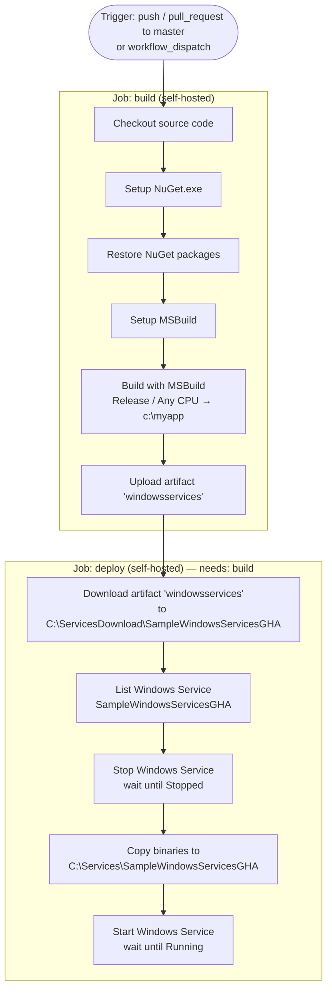

# .Net Full Framework Build and Release to Windows Services

This workflow builds a .NET Full Framework solution and deploys it as a Windows Service on a self-hosted runner. It compiles the project with MSBuild, publishes the build artifacts, then stops the running service, copies the new binaries, and restarts it.

## Triggers

This workflow is activated by:
- **Push** to the `master` branch
- **Pull request** targeting the `master` branch
- **Manual dispatch** (`workflow_dispatch`) — can be triggered on demand from the GitHub Actions UI

## Permissions

No explicit `permissions:` block is declared. The workflow runs with the default repository permissions granted to the `GITHUB_TOKEN`.

## Flow

## Jobs

### Job: `build` — Build

Restores NuGet packages, compiles the .NET Full Framework solution with MSBuild in Release configuration, and uploads the build output as a workflow artifact.

- **Runs on**: `self-hosted`

#### Steps

1. **Checkout**
   - **Action / Command**: `actions/checkout@v2`
   - **Purpose**: Checks out the repository source code onto the self-hosted runner.

2. **Setup NuGet.exe for use with actions**
   - **Action / Command**: `NuGet/setup-nuget@v1.0.5`
   - **Purpose**: Installs and configures the NuGet CLI so packages can be restored in subsequent steps.

3. **Restore Packages**
   - **Action / Command**: Runs shell command — `nuget restore $env:Solution_Name`
   - **Purpose**: Restores all NuGet dependencies required by the solution before the build.
   - **Key inputs / parameters**: `Solution_Name` = `SampleWindowsServicesGHA.sln`

4. **setup-msbuild**
   - **Action / Command**: `microsoft/setup-msbuild@v1.0.2`
   - **Purpose**: Locates and adds MSBuild to the PATH so it can be invoked directly in later steps.

5. **Build using MSBuild**
   - **Action / Command**: Runs shell command — `msbuild $env:Solution_Name /p:platform=... /p:Configuration=... /p:OutputPath=...`
   - **Purpose**: Compiles the solution in Release mode targeting "Any CPU" and writes the output to `c:\myapp`.
   - **Key inputs / parameters**: `buildPlatform` = `Any CPU`, `buildConfiguration` = `Release`, `OUTPUT_DIRECTORY` = `c:\myapp`

6. **Publish Artifacts**
   - **Action / Command**: `actions/upload-artifact@v1.0.0`
   - **Purpose**: Uploads the compiled binaries from `c:\myapp` as a named artifact so the `deploy` job can download them.
   - **Key inputs / parameters**: `name` = `windowsservices`, `path` = `c:\myapp`

---

### Job: `deploy` — Deploy

Downloads the build artifact and deploys it to the Windows Service by stopping the service, replacing its files, and restarting it — waiting at each stage to confirm the service state transition.

- **Runs on**: `self-hosted`
- **Needs**: `build`

#### Steps

1. **Download a Build Artifact**
   - **Action / Command**: `actions/download-artifact@v2.0.7`
   - **Purpose**: Downloads the `windowsservices` artifact produced by the `build` job to a staging directory on the runner.
   - **Key inputs / parameters**: `name` = `windowsservices`, `path` = `C:\ServicesDownload\SampleWindowsServicesGHA`

2. **List Windows Services SampleWindowsServicesGHA**
   - **Action / Command**: Runs shell command (PowerShell) — `Get-Service -Name SampleWindowsServicesGHA`
   - **Purpose**: Verifies the Windows Service exists on the runner before attempting to stop it.

3. **Stop Windows Services SampleWindowsServicesGHA**
   - **Action / Command**: Runs shell command (PowerShell) — `Stop-Service` with a polling loop
   - **Purpose**: Stops the Windows Service and waits in a loop until its status transitions to `Stopped`, ensuring no files are locked before copying.

4. **Copy Windows Services files**
   - **Action / Command**: Runs shell command (PowerShell) — `Copy-Item -Force`
   - **Purpose**: Copies the newly downloaded binaries from the staging directory to the live service directory, overwriting the previous version.
   - **Key inputs / parameters**: Source = `C:\ServicesDownload\SampleWindowsServicesGHA\*`, Destination = `C:\Services\SampleWindowsServicesGHA`

5. **Start Windows Services SampleWindowsServicesGHA**
   - **Action / Command**: Runs shell command (PowerShell) — `Start-Service` with a polling loop
   - **Purpose**: Starts the Windows Service and waits in a loop until its status transitions to `Running`, confirming a successful deployment.

## Required Secrets and Variables

None.
